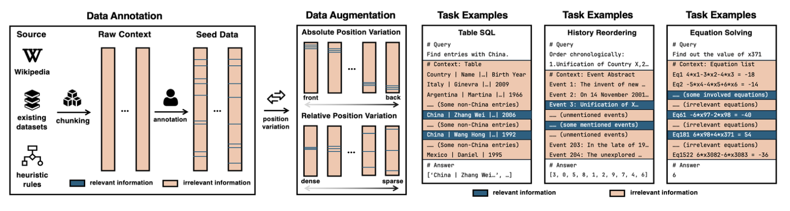

# LongPiBench

**LongPiBench** is a benchmark designed to assess the positional biases in large language models (LLMs) when processing long contexts, specifically targeting biases arising from the spacing of multiple pieces of relevant information. 

## Overview

LongPiBench evaluates how well long-context LLMs handle tasks that involve multiple relevant information pieces distributed throughout the input context. The benchmark focuses on two types of positional biases:

- **Absolute Positional Bias**: The position of relevant information in the input (beginning, middle, end).
- **Relative Positional Bias**: The spacing between relevant information pieces and how densely they are distributed across the context.

The benchmark includes tasks of varying complexity and spans four different input lengths: 32K, 64K, 128K, and 256K tokens.

## Key Features

- **Comprehensive Evaluation**: LongPiBench is the most comprehensive benchmark for isolating and analyzing positional biases in long-context LLMs. It tests the impact of both absolute and relative positional biases on model performance.
- **Diverse Tasks**: The benchmark contains three primary tasks:
 